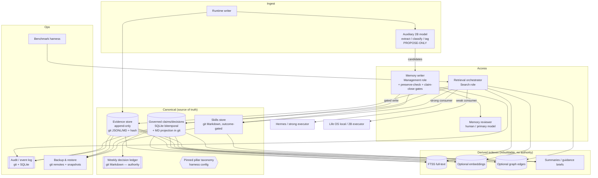
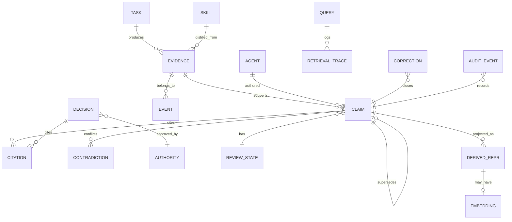

# HVE Long-Term Memory Architecture Plan — Hermes and HVE Life OS

**Filename:** `2026-09-09-hve-hermes-hve-life-os-long-term-memory-architecture-plan-v1.0.md`
**Date:** 2026-09-09
**Author:** Luna, HVE Head Architect / CTO (executing the Claude Opus 4.8 principal-architect prompt)
**Status:** PROPOSED architecture and decision package for HVE agent + executive consensus. **Not** an approved production architecture, migration authorization, or policy decision. Adoption requires explicit Hans/HVE approval recorded in the weekly decision ledger.
**Working directory:** `/home/hans/humanvalueexchange`
**Repository (system of record):** `HansHWestphal/hve-knowledge-and-operations`

---

## 0. Source-access statement (read this first)

All five artifacts required by the prompt were successfully accessed and examined directly.

| # | Artifact | Date / version | Accessed | How verified |
|---|---|---|---|---|
| 1 | Zhou et al., *Filesystem-Based Memory for LLM Agents: Organization, Evolution, and Sustainability* (white paper) | arXiv:2607.26637**v1**, 29 Jul 2026, 59 pp. | ✅ Yes | Local PDF `agent-communications/2607.26637v1.pdf` (2,232,154 bytes); extracted full text (~280 KB); numbers below verified against the paper's own tables/prose, not the briefs. |
| 2 | Luna / HVE CTO consensus brief | 2026-09-09, v1.0 | ✅ Yes | Repo file `agent-communications/2026-09-09-hve-filesystem-memory-architecture-consensus-brief-v1.0.md`. |
| 3 | HVE-Librarian position brief | 2026-09-09, v0.1 draft | ✅ Yes | Repo file `agent-communications/2026-09-09-hve-filesystem-memory-architecture-v0.1.md`. |
| 4 | Microsoft 365 Copilot position brief | September 2026 (undated day) | ✅ Yes | `https://github.com/user-attachments/files/32028493/HVE_Life_OS_Filesystem_Memory_Brief.pdf` (5 pp.). |
| 5 | Grok position brief | 2026-09-09 | ✅ Yes | `https://github.com/user-attachments/files/32028721/Grok-HVE_LifeOS_Filesystem_Memory_Brief.pdf` (14 pp. / 5 content pages). |

**Limitations caused by source availability:** None blocking. The commit index page `57ee02c1…` was used only as a pointer; the direct artifact links resolved. The white paper's figures (e.g., Figure 8/9 growth and adherence curves) are read from the surrounding prose and tables rather than pixel-level chart values; where I cite a figure I paraphrase its stated conclusion and mark confidence accordingly. Both position PDFs (MS365, Grok) are HVE-internal design readings authored around the same paper and share its citations; they are **interpretations**, not independent evidence.

**Evidence-label legend** (used throughout): **[WP]** direct white-paper finding · **[PP]** finding asserted by one position paper · **[X-AGREE]** cross-source agreement · **[INT]** interpretation · **[DES]** proposed HVE design decision · **[ASSUMPTION]** requires validation · **[OPEN]** open question · **[REJECT]** unsupported or contradicted claim. Confidence: High / Medium / Low.

---

## Table of contents

1. Phase 1 — Source inventory
2. Phase 2 — Independent white-paper analysis
3. Phase 3 — Position-paper comparison matrix
4. Phase 4 — Hermes & HVE Life OS requirements
5. Phase 5 — Candidate architecture evaluation
6. Phase 6 — Target architecture
7. Phase 7 — Memory data model
8. Phase 8 — Retrieval & memory-write protocols
9. Phase 9 — Auxiliary-model role
10. Phase 10 — Benchmark & evaluation plan
11. Phase 11 — Migration & rollout
12. Phase 12 — Operational & governance plan
13. Phase 13 — Final decision package
14. Appendices — Bibliography · Traceability matrix · Standing assumptions · Decisions needing HVE approval

---

## Phase 1 — Source inventory

| Artifact | Author / originating system | Date / version | Source type | Apparent purpose | Evidence strength | Class | Key limitations / missing info |
|---|---|---|---|---|---|---|---|
| White paper (2607.26637v1) | Zhou, Yu, Wei, Wu, Ouyang, Jiao, Pan, McAuley, Zhang, Yu, Han (UIUC/UCSD/UCMerced/Adobe/TAMU) | 29 Jul 2026 | Peer-style research preprint (arXiv) | First systematic study of filesystem memory: does organization stay manageable and does it pay? | **Highest** — controlled experiments, growth curves, ablations | Research | Horizons ≤140 tasks and ≤128 KB / 128k-context streams; conversational + embodied benchmarks, **not** multi-year personal life data; one vendor's model family + rate card; small per-tier question counts (32–158) with deltas near re-judge noise (±1.3 pt). |
| Luna / CTO consensus brief | Luna (this office) | 2026-09-09 v1.0 | Internal proposal / synthesis | Propose a governed **SQLite/FTS5-canonical hybrid** with derived Markdown/skill/embedding views; request consensus + benchmark | Medium (design proposal grounded in [WP]) | Proposal | Leans on existing HVE SQLite/FTS5 as baseline; does not itself supply new experimental data. |
| HVE-Librarian brief (v0.1) | HVE-Librarian | 2026-09-09 v0.1 | Internal position brief | Adopt three-role model as **reference architecture + validation contracts**, keep current Markdown+approved-tool+validation stack, run bounded pilot | Medium; strong fidelity to [WP] numbers with explicit [S]/[I]/[P]/[A]/[Q] labels | Interpretation + proposal | Argues HVE already runs the paper's shape; risk of confirmation bias toward the status quo. Provenance record `4186ea9a8ca5b553`. |
| MS365 Copilot brief | Hans + M365 Copilot working session | Sep 2026 | Internal position brief | Adopt **filesystem memory as the default architectural direction**, subject to design review | Medium; conceptual, few numbers | Proposal | Least quantitative; frames sovereignty/portability case; explicitly says vector retrieval remains a complementary index. |
| Grok brief | Grok (xAI), for HVE | 2026-09-09 | Internal position brief | Adopt **filesystem as memory class** with a hard **dual-substrate contract** (append-only raw + bitemporal claims + outcome-gated skills + pinned pillars) enforced **in code, not prompt** | Medium-High; most operationally specific, tightly cites [WP] | Proposal (most implementation-ready) | Strong opinions presented as defaults for a vote; some contracts (claim-close, preserve-check) are proposals not yet validated on HVE data. |

**Confirmation:** All five artifacts were examined. Findings below distinguish direct paper evidence from brief interpretation.

---

## Phase 2 — Independent white-paper analysis

I analyzed the paper before relying on any brief. Verified numbers are quoted from the paper's own tables/prose.

### 2.1 Core problem definition **[WP, High]**
Deployed agents increasingly keep long-term memory as *"a directory tree of markdown files that the agent itself reads, writes, and reorganizes through generic file tools."* The default rests on two **untested assumptions**: (a) an agent can keep a growing store organized as memories *"accumulate, conflict, and go stale,"* and (b) that organization pays. The paper tests both.

### 2.2 Proposed architecture — three roles, one store **[WP, High]**
- **Management agent** — integrates each incoming chunk; creates/edits/merges/splits/moves/reconciles; keeps the store organized.
- **Search agent** — traverses the store read-only; answers with **cited sources**.
- **Execution agent** (skills setting) — attempts tasks; its trajectories supply chunks and consume retrieved skills.
Contracts are deliberately minimal so *"in a coding agent, all three may be one model."* One store unifies **declarative memory** (facts, events, preferences, rules) and **procedural skills**.

### 2.3 Memory organization model **[WP, High]**
Native hierarchy: *"folders form a taxonomy whose names are its labels."* File anatomy: meaningful path, a one-line description (what it is / when to use it), YAML-style frontmatter, nested headings continuing the taxonomy, inline source locators, cross-references instead of duplicate copies. **[WP-RQ1]** Left to organize, agents grow subject-based trees; *"given more material the store consolidates rather than shards."* Store shape is *"a signature of the model more than a response to scale."*

### 2.4 Memory lifecycle model **[WP, High]**
Chunks arrive as a stream; management integrates each and may reorganize. **The clearest degenerate behavior:** *"a reorganizing pass that silently condenses content unless one preservation rule is added."* Healthy stores **edit in place**; early memories survive; deletion/rewrite is rare. Consolidation ("dreaming") in industry runs **outside** the working agent precisely because incremental agent writes *"remain local and incremental"* and the store *"degrades between rebuilds."*

### 2.5 Retrieval / search model **[WP, High]**
Search agent walks the tree or uses tools (file ops, BM25, shell). Attribution/citation stayed high (~82–98%) across filesystem stores — *"citability is cheap; correctness is not."* Retrieval strategy **co-adapts** to layout: BM25 is used heavily on many-file stores (54 calls on LoCoMo) and almost never on a mega-file (twice on PersonaMem 128k).

### 2.6 Evolution / maintenance mechanisms **[WP, High]**
Reorganization with vs. without a *"keep every fact"* rule is the pivotal ablation (see 2.9). Curation is **not compression and not free**: build effort per chunk stays flat (*"no economy of scale"*); one store ended **35% larger** than its input; even the strongest curator kept spending *"eight to ten rounds per episode"* on maintenance after file count plateaued (~task 35 of 140).

### 2.7 Sustainability / cost claims **[WP-RQ4, High]**
Within measured horizons, **stores only become more useful as they grow**, and *"accumulated experience substitutes for execution-agent capability."* Store health holds — **except organization**: *"adherence to the taxonomy contract erodes as most stores grow, and only the strongest management agent we track holds it"* (Figure 9). The one liability that grows with the store is the **verbatim episode log's serve-everything retrieval** (climbs to $7.88 vs. curated GS $2.97; 140 files / 270 KB at chain end).

### 2.8 Evaluation methodology **[WP, High]**
Two instantiations, one store class: **conversation** (LoCoMo, PersonaMem, REALTALK — QA with source attribution) and **procedural** (ALFWorld, 140 household tasks). Variants: closed-book, chunk retrieval, verbatim dump, foldered sessions, reorganize (preserve / condense), from-empty agent-curated. Axes varied: memory shape, **stream scale**, **tool harness** (file ops / file ops+BM25 / bash shell), and **management + search model strength**. Metrics: answer quality + attribution, build/search cost (rounds, tokens, dollars), and **store health over growth — growth curves, not endpoints.**

### 2.9 Benchmarks & metrics — verified numbers **[WP, High]**
- **No shape wins correctness everywhere.** PersonaMem 32k: verbatim dump **78.1** vs. agent-curated store **37.5**; chunk retrieval **71.9** beats curated at 32k. Foldered sessions tie/top three of four conversational benchmarks.
- **Condensing without preservation is destructive.** REALTALK correctness under a free reorganize/condense pass **77.6 → 41.2** (nearly halved); adding one *"keep every fact"* rule held content roughly fixed (Reorg-preserve REALTALK 77.6).
- **Consumer strength flips the winner (skills).** Strong executor: **Episode log 87.1%** (Curated GS 82.1%). Weak executor: **Curated GS 76.4% vs. Episode log 66.4%** (net +10; GS invalid-action rate rises only 12→22% vs. episode log 19→36%). GS *"degrades gracefully."*
- **Search-agent strength pays directly; management strength buys style not answers.** Same three models as search agents were monotone: mean correctness ~**62 → 71 → 79** (nano→mini→full). As management agents on a 128k persona conversation, file count swung an order of magnitude (**122 / 2 / 105**) while answer quality sat in a **~7-point non-monotone band**.
- **Harness is a lever.** Adding BM25 changed behavior not outcome (tie, p≈0.85). Replacing tools with a shell moved outcomes: on skills the shell chain was the mini curator's **best (82.9%, net +11 vs. Center+BM25, p≈0.04)**; on long dialogue the shell **sharded** (147 files) and tied on quality.

### 2.10 Limitations & threats to validity **[WP, High]**
Horizons *"beyond one conversation"* and *"longer-horizon accumulation, our fixed-size benchmarks cannot say."* Whether the large-stream sharding premium is repaid is explicitly **unknown**. Per-tier question counts small; conversational quality benchmarks are *"largely blind to shape."* One vendor's rate card. **No personal, multi-year, privacy-bearing data was tested.**

### 2.11 Claims that do NOT generalize to Hermes / HVE Life OS
- **[REJECT, High]** "Markdown files beat SQLite as canonical store" — the paper **never tested SQLite** or any database as the canonical store; it studied filesystem shapes only. Any brief claim of database inferiority is unsupported by [WP].
- **[REJECT, High]** "Organization improves answer quality" — explicitly falsified: *"no agent we measure converts organization itself into better answers."*
- **[REJECT, Medium]** "Autonomous curation is safe for policy/preferences" — PersonaMem failure (superseded preferences left standing) shows the opposite for a *"persona-rich, preference-changing"* record — exactly the HVE Life OS profile.
- **[OPEN]** Whether any of these hold at **months-to-years** horizons with low-throughput, human-owned data — the HVE regime — is untested and must be measured.

---

## Phase 3 — Position-paper comparison matrix

`SQLite-first` = Luna consensus brief · `Ref-arch` = Librarian · `FS-default` = MS365 · `Dual-substrate` = Grok.
Cells summarize each brief's **position**; ⚑ marks a genuine disagreement analyzed below.

| Dimension | Luna (SQLite-first) | Librarian (Ref-arch) | MS365 (FS-default) | Grok (Dual-substrate) |
|---|---|---|---|---|
| **Canonical store** ⚑ | **SQLite/FTS5** evidence store, canonical | Current **Markdown + approved-tool + validation** stack (filesystem) | **Filesystem/Markdown** = default system of record | **Markdown filesystem** = memory class; embeddings/keyword are access methods not stores |
| **Filesystem vs DB roles** ⚑ | DB canonical; MD/skills/embeddings = **derived views** | Filesystem canonical; DB not foregrounded | One filesystem substrate, governed views; vector = complementary index | Filesystem canonical; DB/index derived |
| **Markdown / human-readable** | Governed projection, inspectable | Core store; skills as distilled procedures | Core: sovereignty, inspectability, portability | Core: raw + claims + skills + pillars, all MD |
| **SQLite / FTS5** ⚑ | **Canonical** local mechanism | Present but not named as canonical | Complementary access method | Access method, not system of record |
| **Embeddings / vectors** | Rebuildable derived view; not authority | Not emphasized; bounded retrieval preferred | Complementary index over filesystem; "not unnecessary" | Access method; **reject as system of record** |
| **Graph / relationships** | Not primary | Not emphasized | Not emphasized | **Reject** bespoke graph as system of record |
| **Memory creation** | Management role extracts candidates | Capture→archive→process→curate pipeline | Agents propose; authority gates writes | Mechanical raw dump; claims opened w/ source |
| **Consolidation** | Contract-bounded; dry-run + diff | Reversible, edit-in-place; conflicts to human | Reconcile/consolidate before new file | Scheduled preserve-constrained "dreams"; raw never rewritten |
| **Compression** | Allowed only within contracts | Not compression; elaboration acknowledged | Preserve before compressing | Condensing = default failure; forbid free rewrite |
| **Deletion** | Append-first; no silent delete | No raw append outside pipeline; failures logged | No silent delete; retain source links | Never delete history; close claims instead |
| **Correction** | Versioned supersession | Reversible curation, human-routed conflicts | Human owner for sensitive updates | Claim-close (valid_to + source) **in code** |
| **Provenance** | Source ref + quote + authority class required | Manifest + sha256 + validation as instruments | Provenance by default | Inline source locators mandatory per write |
| **Temporal validity** | observed/effective/superseded timestamps | Temporal fields to verify | Dating required | **Bitemporal** claims; close prior on same key |
| **Authority** | Weekly decision ledger authoritative | Governance chain; Hans sign-off | Explicit write authority for sensitive data | Root pillars = product; humans own sensitive keys |
| **Conflict resolution** | Surface conflicts, don't auto-pick newest | Route conflicts to human | Governed curator | Supersede, never silently overwrite |
| **Retrieval orchestration** | Grounded, bounded, conflict-aware | Bounded retrieval (max_chunks/chars) | Retrieval fit to consumer | **Dual serve**: raw to strong, synthesized guidance to weak |
| **Agent vs auxiliary model** | 2B = bounded deriver, never durable owner | Local mid-tier steward = the eroding profile | Constrained agents get concise guidance | Strong model for reconciliation/distillation; cheap for search |
| **Benchmarks** | 4-variant HVE benchmark w/ growth curves | 4 growth contracts + bounded pilot | Prototype + governance contract | Store-health counters; preserve-check fail rate |
| **Migration** | Adopt architecture, prove implementation; keep SQLite baseline | Reference arch now, no migration | Controlled prototype | 30-day cut; enforce contracts before rollout |
| **Rollback** | Diff + impact + reversible change set | Reversible curation | (implicit) | Dry-run rebuild; don't land if preserve fails |
| **Operational risks** | Silent lossy consolidation, stale promotion, authority leakage | Management-agent erosion (quiet), tool drift, episode-log bloat | Stale facts, flattened chronology, duplication | Superseded-trait-as-live; free rewrite deletes Life OS |
| **Unresolved questions** | Which workload benches first | Months-scale behavior vs. week-scale paper | Detailed schema/lifecycle | Horizon honesty — instrument, don't assume |

### 3.1 Agreements (all four) **[X-AGREE, High]**
1. Adopt the **three-role decomposition** (management / search / execution), even if one model plays all roles.
2. **Separate raw evidence from curated memory**; raw is append-only and preserved.
3. **Preserve-before-compress** — reorganization must not silently drop facts (directly from the [WP] REALTALK ablation).
4. **Provenance + temporal metadata are mandatory** on durable state; distinguish "was true" from "is true now."
5. **Authority is gated** — agents propose; sensitive/policy writes need human/owner approval.
6. **This is a proposal, not an approved migration**; no destructive change; adoption needs Hans sign-off.
7. Organization is **not** the quality KPI; measure store health over **growth**.

### 3.2 Disagreements (preserved, not averaged)

**⚑ D1 — Canonical substrate: SQLite-first (Luna/Librarian-leaning) vs. Filesystem-first (MS365/Grok).**
- *SQLite-first case:* transactional integrity, cheap indexed/bitemporal queries, enforce-in-code constraints, existing HVE FTS5 baseline. **[INT]**
- *Filesystem-first case:* sovereignty, portability, human inspectability, survivability across models/vendors/hardware; matches deployed practice studied by [WP]. **[PP: MS365 p.2–3; Grok §5]**
- *Tradeoff analysis:* The [WP] does **not** adjudicate this — it never benchmarked a database. So D1 cannot be resolved by citing the paper. The real axes are **durability/portability/auditability (filesystem+git wins)** vs. **query power / constraint enforcement / bitemporal correctness (SQLite wins)**. **Averaging is wrong; the correct move is to split ownership by content type and require the structured store to be rebuildable from the filesystem** (see Phase 5–6). **[DES]**

**⚑ D2 — Where temporal correctness is enforced: prompt vs. code.**
- Grok is emphatic: prompt-only reconciliation *"already falsified"* by the PersonaMem cell (management prompt required dated reconciliation; model applied it inconsistently; 12/32→18/32 with a stronger builder, still far below verbatim). Enforce **claim-close in code**. **[PP: Grok §3.4, §4; strongly supported by WP]**
- Luna/Librarian imply governance + validation instrumentation. Less explicit that the *close* is a hard, code-level rejected write.
- *Resolution:* **[DES]** Adopt Grok's stance — temporal supersession is a **code-enforced write gate**, not a prompt hope. This is the single best-evidenced operational finding.

**⚑ D3 — Serve policy for weak executors.**
- Grok/MS365: **dual serve** — synthesized, task-specific guidance to weak/local models; raw to strong models. Grok warns strict *"only serve what clearly applies"* without synthesis is the cell that **collapsed** for weak executors.
- Luna/Librarian: bounded, grounded retrieval (less explicit on synthesis-vs-citation split).
- *Resolution:* **[DES]** Adopt dual-serve, tied to executor capability (Hermes 27B/strong vs. Life-OS local/2B), grounded in [WP-RQ2] (GS 76.4 vs. episode log 66.4 at weak tier).

**⚑ D4 — Vector/embeddings.** MS365 keeps vectors as a complementary index; Grok/Librarian de-emphasize; Luna treats as rebuildable derived view. *Resolution:* **[DES]** embeddings are an **optional, rebuildable derived index with zero authority**, adopted only if benchmarks show it beats FTS5 on HVE queries (Phase 10).

### 3.3 Unique insights
- **Librarian:** HVE already runs the three roles unnamed; taxonomy-adherence is the one property HVE does **not** currently measure; tool-inventory change is an architecture change *"wearing a config costume."* **[PP, Medium]**
- **Grok:** the four-layer contract (`raw/ claims/ skills/ pillars/`), **outcome-gated skills** (a failure never becomes a positive how-to), **bitemporal claim-close in code**, **preserve-check in code** (every named entity/number/date/ticker/key from a chunk must remain findable). Most implementation-ready. **[PP, Medium-High]**
- **MS365:** sovereignty/portability/multi-generational durability framing; explicit "do not conclude vectors are unnecessary." **[PP, Medium]**
- **Luna:** four-layer authority model (evidence/governed-state/retrieval/guidance) + explicit rollback/dry-run requirement. **[PP, Medium]**

### 3.4 Unsupported or experiment-gated recommendations
- **[REJECT/Gate]** "Adopt filesystem as the *default against which alternatives must justify themselves*" (MS365) presumes a conclusion the paper does not support about **canonical substrate**; treat as a hypothesis to benchmark, not a default.
- **[Gate]** Grok's specific defaults (weekly preserve-rebuild cadence, "strong model reserved for reconciliation") are sensible **[ASSUMPTION]**s requiring the Phase 10 benchmark before standing adoption.
- **[Gate]** Librarian's claim that "the form we already chose is strongest under weak executors" transfers only the **shape** of the GS>episode-log inversion, not HVE-specific magnitudes — must be re-derived on HVE data.

---

## Phase 4 — Hermes & HVE Life OS requirements

### 4.1 Must-have architectural invariants (MH)
- **MH-1 Evidence is append-only.** No autonomous pass may delete or overwrite raw source evidence. **[X-AGREE]**
- **MH-2 Preserve-before-compress, enforced in code.** Any reorganization/consolidation must prove every named entity, number, date, identifier, and preference key from the input still resolves in raw or an open/closed claim; else the write is **rejected**. **[WP REALTALK 77.6→41.2; Grok §4]**
- **MH-3 Bitemporal, supersede-not-delete state.** Changing a live claim **closes** the prior claim (`valid_to` + source) before opening the new one; history is never destroyed. Code-enforced. **[WP PersonaMem; Grok D2]**
- **MH-4 Provenance on every durable record** — source locator + quotation/paraphrase + authority class + confidence. **[X-AGREE]**
- **MH-5 Authority gating.** Decisions/policies require owner, approval status, effective/review dates, rationale, provenance; only the **weekly decision ledger** confers "approved" status; agents may only propose. **[HVE governance; X-AGREE]**
- **MH-6 Derived indexes are rebuildable and carry no authority.** FTS5, embeddings, graph edges, summaries are fully regenerable from evidence+claims. A summary is **never** evidence. **[X-AGREE + prompt]**
- **MH-7 Structured store rebuildable from durable substrate.** The SQLite metadata store must be reconstructable from git-committed evidence + claim projections; neither substrate is a single point of failure. **[DES — resolves D1]**
- **MH-8 Scope isolation.** Agent / user / project / company scopes stay separate; an internal helper is not an exposed tool; one agent cannot write another agent's authority domain. **[HVE UAT discipline; X-AGREE]**
- **MH-9 Conflict visibility.** Retrieval surfaces unresolved conflicts rather than silently choosing newest/most-frequent. **[WP; X-AGREE]**
- **MH-10 Reversibility & audit.** Every maintenance action emits a diff + impact summary + reversible change set + audit event; git is the durable audit spine. **[X-AGREE + HVE GitHub-as-record]**
- **MH-11 Local-model compatibility.** Retrieval/serve must work within constrained local inference; Hermes agent + auxiliary compression contexts **≥ 64K tokens**. **[HVE hard constraint]**

### 4.2 Strongly preferred (SP)
- **SP-1 Dual serve** by consumer strength (guidance synthesis for weak/local executors; raw+claims+skills for strong Hermes). **[WP-RQ2; D3]**
- **SP-2 Pinned root taxonomy** (Five Wealth pillars + agents/people/skills/governance); agents grow files/headings **inside** a pillar, never invent top-level ontology. **[WP-RQ5 harness lever; Grok §3.6]**
- **SP-3 Outcome-gated skills** — only a success creates/extends a positive procedure; failures become warning notes/corrections. **[PP: Grok Q4]**
- **SP-4 Store-health telemetry** — overwrite rate, stale-claim rate, retrieval tokens/query, scope-leakage, taxonomy-adherence, preserve-check fail rate. **[WP-RQ4; Librarian]**
- **SP-5 Human-readable projections** committed to git for every material change. **[HVE visibility]**

### 4.3 Optional (OPT)
- **OPT-1** Embedding index (only if it beats FTS5 on HVE benchmark). **[D4]**
- **OPT-2** Lightweight relationship/graph edges as a derived index for supersession/contradiction traversal. **[OPEN]**
- **OPT-3** Scheduled preserve-constrained "dream" rebuild (weekly), never touching raw. **[Grok Q8, ASSUMPTION]**

### 4.4 Explicit non-goals
- **NG-1** No embeddings/vectors as canonical source of truth. **[X-AGREE]**
- **NG-2** No destructive migration; no wholesale rewrite of existing Hermes/Life-OS memory. **[X-AGREE]**
- **NG-3** No bespoke graph/page-OS as system of record. **[Grok §5]**
- **NG-4** No autonomous rewrite of personal, client, legal, health, or financial memory. **[MS365 p.4]**
- **NG-5** No claim of production readiness or approval from this document.

### 4.5 Open questions
- **[OPEN-1]** Does the GS>episode-log inversion, retrieval-halving, and taxonomy-erosion hold at HVE's months-to-years, low-throughput horizon?
- **[OPEN-2]** Is SQLite bitemporal the right enforcement engine, or does a git-native claim-file format with a code preserve-check suffice for Life OS's write volume?
- **[OPEN-3]** Which first benchmark workload: team decisions/handoffs, Time-Wealth continuity, Five-Wealth goal tracking, or Hermes skill learning?
- **[OPEN-4]** Embedding value over FTS5 on HVE's real query distribution.

### 4.6 Requirements that cannot be finalized without experiments
Serve-split thresholds; consolidation cadence; embedding inclusion; acceptance numeric thresholds (Phase 10); whether auxiliary 2B extraction meets precision gates.

### 4.7 Concrete memory operations (owner / authority / evidence / failure / audit)

| Op | Owner | Inputs | Outputs | Authority | Evidence req. | Failure behavior | Audit |
|---|---|---|---|---|---|---|---|
| **ingest** | Runtime writer | raw event/message/trajectory | append-only evidence record | none (mechanical) | timestamp, actor, channel | reject malformed; quarantine | evidence id + hash committed |
| **normalize** | Writer | raw record | canonicalized text/fields | none | preserves original | keep raw untouched | diff |
| **classify** | Aux 2B (proposal) | normalized record | type/scope/authority-class candidates + confidence | propose-only | schema-valid JSON | reject invalid → human/primary | classification trace |
| **extract** | Aux 2B (proposal) | record | candidate claims/entities + confidence | propose-only | source locator per claim | low-confidence → review queue | extraction trace |
| **store (evidence)** | Writer | evidence record | committed raw artifact + SQLite mirror row | none | hash + provenance | fail closed; no partial | commit SHA |
| **store (claim)** | Management + gate | candidate claim | bitemporal claim row + MD projection | gated | source + prior-claim close | reject if no close/source | claim id + supersession link |
| **retrieve** | Search | query + scope | ranked records + citations + conflicts | read-only | must cite | return "not found" honestly | retrieval trace |
| **rank** | Search | candidates | ordered set | read-only | — | fall back to raw scan | — |
| **cite** | Search | answer + records | source-linked answer | read-only | locator required | no fabricated citation | — |
| **summarize** | Aux 2B / Search | records | derived summary (non-authoritative) | derived | links to sources | mark stale; never promote | rebuild id |
| **consolidate** | Management | claim/skill set | merged/edited records + diff | gated + preserve-check | preserve-check pass | reject on entity loss | diff + reversible set |
| **supersede** | Management + gate | new claim | prior closed, new opened | gated | source + valid_to | reject if prior not closed | supersession event |
| **correct** | Management + owner | user correction | closing claim + new claim + audit | owner authority | user statement as source | never silent | correction event |
| **quarantine** | Writer/Reviewer | suspect record | isolated, excluded from serve | reviewer | reason code | fail safe (exclude) | quarantine event |
| **archive** | Management + approval | cold records | moved to archive scope, still queryable | approval | retention policy | reversible | archive event |
| **delete** | Human owner only | explicit request | tombstone (soft) + reason | **human only** | explicit approval | forbidden autonomously | delete event + tombstone |
| **export** | Any (scoped) | scope | portable MD/JSON bundle | read-only | scope check | partial → error | export log |
| **restore** | Operator | backup + git | rebuilt store | operator | integrity check | halt on mismatch | restore report |
| **audit** | System | any op | append-only audit event | none | actor + before/after ref | must not fail silently | git + audit table |

---

## Phase 5 — Candidate architecture evaluation

Scores: ●●● strong · ●●○ adequate · ●○○ weak. Grounded in [WP] where it speaks; [DES]/[INT] otherwise (the paper is silent on DB/vector/graph as canonical).

| Criterion | 1. Filesystem-first | 2. SQLite/FTS5-first | 3. Vector-first | 4. Graph-first | 5. DB + FS evidence | 6. **Hybrid layered (target)** |
|---|---|---|---|---|---|---|
| Retrieval quality | ●●○ | ●●○ | ●●○ (fuzzy) | ●●○ | ●●○ | **●●●** |
| Provenance | ●●● | ●●○ | ●○○ | ●●○ | ●●● | **●●●** |
| Human inspectability | ●●● | ●○○ | ●○○ | ●○○ | ●●○ | **●●●** |
| Temporal reasoning | ●○○ (prompt-only risk) | ●●● (bitemporal) | ●○○ | ●●○ | ●●● | **●●●** |
| Conflict handling | ●○○ | ●●○ | ●○○ | ●●● | ●●○ | **●●●** |
| Update complexity | ●●○ | ●●○ | ●●○ | ●○○ | ●●○ | **●●○** |
| Scale (yrs) | ●●○ | ●●● | ●●○ | ●○○ | ●●● | **●●●** |
| Latency | ●●○ | ●●● | ●●○ | ●○○ | ●●● | **●●●** |
| Local-model compat | ●●● | ●●● | ●○○ (embed cost) | ●○○ | ●●● | **●●●** |
| Storage cost | ●●○ | ●●● | ●○○ | ●●○ | ●●○ | **●●○** |
| Operational complexity | ●●● (simple) | ●●○ | ●○○ | ●○○ | ●●○ | **●●○** |
| Backup / restore | ●●● (git) | ●●○ | ●●○ | ●○○ | ●●● | **●●●** |
| Migration difficulty | ●●● (already there) | ●●○ | ●○○ | ●○○ | ●●○ | **●●○** |
| Rollback | ●●● (git) | ●●○ | ●●○ | ●○○ | ●●● | **●●●** |
| Suitability — Hermes | ●●○ | ●●● | ●●○ | ●●○ | ●●● | **●●●** |
| Suitability — Life OS | ●●● | ●●○ | ●●○ | ●●○ | ●●● | **●●●** |
| Worst failure mode | silent condense; no temporal enforcement | opaque to humans; single-file corruption | hallucinated similarity as fact; no provenance | brittle, costly, over-engineered | two stores drift | complexity if layers blur |

**Verdicts:**
- **1 Filesystem-first** — Rejected as *sole* architecture: strong on sovereignty/audit but the paper shows prompt-level temporal reconciliation fails (PersonaMem), so it cannot guarantee MH-2/MH-3 by itself. **Retained as the canonical evidence + human-projection substrate.**
- **2 SQLite/FTS5-first** — Rejected as *sole* architecture: excellent temporal/query power but poor human inspectability and violates HVE's git-as-record + sovereignty needs; single-file opacity. **Retained as the canonical structured-metadata + index engine.**
- **3 Vector-first** — **Rejected as canonical** (NG-1): no provenance, encourages similarity-as-truth. **Retained only as an optional rebuildable index (OPT-1) pending benchmark.**
- **4 Graph-first** — **Rejected** (NG-3): operational cost/brittleness unjustified by evidence at HVE scale. **Optional derived edges only (OPT-2).**
- **5 DB + FS evidence** — Close to target but under-specifies *ownership* and drift control; folded into #6.
- **6 Hybrid layered — RECOMMENDED**, with **crisp per-layer ownership and a rebuildability invariant (MH-7)** so it is not "hybrid because it sounds safe."

---

## Phase 6 — Target architecture

### 6.1 Architectural principles
1. **Evidence is sacred and append-only.** (MH-1)
2. **Truth is bitemporal and sourced.** "Was true" ≠ "is true now." (MH-3)
3. **One canonical copy per fact, by content type; everything else is a rebuildable projection.** (MH-6/7)
4. **Enforce invariants in code, not prompts.** (D2)
5. **Serve the consumer, not the tree.** (SP-1)
6. **Pin the taxonomy; grow inside it.** (SP-2)
7. **Every change is reversible and audited via git.** (MH-10)
8. **Agents propose; humans/ledger approve authority.** (MH-5)

### 6.2 Source-of-truth rules (resolves D1 decisively)

| Content type | Canonical source of truth | Rebuildable projection(s) | Never canonical |
|---|---|---|---|
| Raw events, messages, trajectories, documents | **Git-committed evidence files** (JSONL/MD) + content hash | SQLite `events` mirror; FTS5; embeddings | SQLite, vector, summary |
| Current claims / preferences / balances / decisions | **SQLite bitemporal `claims`/`decisions`** (constraint-enforced) *with* a git-committed **Markdown projection** as the human-verifiable, portable copy | FTS5, embeddings, graph edges, summaries | vector, summary |
| Approved decisions & policy | **Weekly decision ledger (git Markdown)** — the authority record | SQLite `decisions` rows referencing ledger | any agent-written note |
| Skills / procedures | **Git-committed skill Markdown** (outcome-gated) | SQLite skill registry; FTS5 | failure-derived "how-to" |
| Pillar taxonomy | **Pinned config in the tool harness** (git) | filesystem folders | agent-invented ontology |

**The rebuildability invariant (MH-7):** SQLite is authoritative *for enforcement and query* on claims, but must be **fully reconstructable** from the git evidence log + Markdown claim projections. Git is authoritative *for durability, audit, and human trust*. Neither is a single point of failure; a nightly job asserts `rebuild(SQLite) == committed state`.

### 6.3 Logical & physical components



### 6.4 Component contracts (stores / may change / must not change / consistency / rebuild / failure / observability)

| Component | Stores | May change | **Must NOT change** | Consistency | Rebuildable? | Failure behavior | Observability |
|---|---|---|---|---|---|---|---|
| **Evidence store** | raw events/msgs/trajectories + hash | append new | any existing byte | strong (immutable) | it *is* the base | fail-closed on write | count, bytes, hash-chain |
| **Claims/decisions (SQLite+MD)** | bitemporal facts/decisions | open/close via gate | delete history; skip source; skip prior-close | transactional + preserve-check | from EV+MD | reject on gate fail | overwrite/stale-claim rate |
| **Decision ledger** | approved decisions/policy | append approved entries | retroactively edit approvals | human-approved | from git history | escalate on conflict | approval coverage |
| **Skills store** | distilled procedures | edit-in-place, extend | turn a failure into positive how-to | outcome-gated | from EV | reject failure-sourced skill | skill use, staleness |
| **FTS5 index** | tokens/text | rebuild anytime | be treated as authority | eventual | yes (drop+rebuild) | rebuild on drift | index lag |
| **Embeddings (opt)** | vectors | rebuild | be a source of truth | eventual | yes | disable → fall back FTS5 | recall vs FTS5 |
| **Graph edges (opt)** | supersede/contradict links | rebuild | be a source of truth | eventual | yes | disable | edge integrity |
| **Retrieval orchestrator** | none (stateless) | ranking policy | fabricate citations | read-only | n/a | return "not found" | precision/recall, latency |
| **Memory writer** | none durable | proposals, diffs | bypass gates | n/a | n/a | reject + audit | write-precision, reject rate |
| **Reviewer** | review state | approve/reject | approve without evidence | n/a | n/a | block promotion | review latency/burden |
| **Auxiliary 2B** | none | candidate JSON | write canonical directly | n/a | n/a | invalid → reject | schema-valid %, confidence |
| **Audit log** | events | append | edit/delete events | append-only | from git | must not fail silently | event coverage |
| **Backup/restore** | snapshots | new snapshots | mutate snapshots | point-in-time | n/a | halt on integrity fail | RPO/RTO, restore test pass |
| **Benchmark harness** | fixtures/results | new runs | alter production stores | isolated | n/a | isolate failures | gate pass/fail |

### 6.5 Path definitions
- **Read path (strong consumer):** orchestrator → scope filter → FTS5(+opt vector) candidates → hydrate EV/CL/SK → conflict check → cited answer with raw+claims+skills.
- **Read path (weak consumer):** orchestrator retrieves → **synthesizes task-specific guidance brief** (SP-1) → serves brief only (executor never browses tree).
- **Write path:** ingest → aux extract (propose) → writer preserve-check + source check → for state, **claim-close gate** → commit MD projection + SQLite row + git → audit.
- **Correction path:** user correction → close affected claim(s) with user statement as source → open corrected claim → audit; never silent.
- **Conflict path:** on retrieval, unresolved contradictions surfaced with both sources + timestamps; not auto-resolved.
- **Archival path:** approval-gated move to archive scope; still queryable; reversible.
- **Rollback path:** `git revert` of the change commit + SQLite rebuild from restored projection; every maintenance op ships a reversible change set.

---

## Phase 7 — Memory data model

Implementable on local SQLite; JSON shown for evidence/claim payloads. IDs are ULIDs (sortable). All timestamps ISO-8601 UTC.

### 7.1 Entity overview



### 7.2 Core schemas (SQLite DDL, abbreviated but implementable)

```sql
-- APPEND-ONLY EVIDENCE (mirror of git-committed files; git is durable copy)
CREATE TABLE evidence (
  id            TEXT PRIMARY KEY,           -- ULID
  kind          TEXT NOT NULL,              -- message|event|trajectory|document
  actor         TEXT NOT NULL,              -- agent/user/system id
  scope         TEXT NOT NULL,              -- agent|user|project|company + name
  channel       TEXT,                       -- source channel
  observed_at   TEXT NOT NULL,              -- when it happened
  ingested_at   TEXT NOT NULL,
  body          TEXT NOT NULL,              -- normalized text (raw preserved in git)
  git_path      TEXT NOT NULL,              -- canonical file locator
  content_hash  TEXT NOT NULL,              -- sha256 of raw
  CHECK (kind IN ('message','event','trajectory','document'))
);                                          -- no UPDATE/DELETE by policy

-- GOVERNED BITEMPORAL CLAIMS (current-state truth)
CREATE TABLE claim (
  id            TEXT PRIMARY KEY,
  subject_key   TEXT NOT NULL,              -- e.g. 'user:hans/pref:diet'
  predicate     TEXT NOT NULL,
  value         TEXT NOT NULL,
  scope         TEXT NOT NULL,
  authority_class TEXT NOT NULL,            -- fact|preference|decision|policy|observation
  confidence    REAL NOT NULL,              -- 0..1
  observed_at   TEXT NOT NULL,              -- when the world became this
  effective_from TEXT NOT NULL,             -- valid-time start
  effective_to  TEXT,                       -- valid-time end (NULL = live)
  recorded_at   TEXT NOT NULL,              -- transaction-time start
  superseded_by TEXT REFERENCES claim(id),  -- supersession link
  supersedes    TEXT REFERENCES claim(id),
  review_state  TEXT NOT NULL DEFAULT 'proposed', -- proposed|accepted|quarantined|rejected
  git_path      TEXT NOT NULL,              -- MD projection locator
  CHECK (authority_class IN ('fact','preference','decision','policy','observation')),
  CHECK (confidence BETWEEN 0 AND 1)
);
-- INVARIANT (MH-3): opening a new live claim on an existing subject_key
-- REQUIRES effective_to set on the prior live claim in the same txn.
CREATE UNIQUE INDEX one_live_claim
  ON claim(subject_key) WHERE effective_to IS NULL AND review_state='accepted';

CREATE TABLE citation (
  id TEXT PRIMARY KEY,
  claim_id TEXT REFERENCES claim(id),
  evidence_id TEXT REFERENCES evidence(id) NOT NULL,
  quote TEXT NOT NULL,                      -- supporting quotation/paraphrase
  locator TEXT NOT NULL                     -- offset/section within evidence
);

CREATE TABLE contradiction (
  id TEXT PRIMARY KEY,
  claim_a TEXT REFERENCES claim(id),
  claim_b TEXT REFERENCES claim(id),
  status TEXT NOT NULL DEFAULT 'open',      -- open|resolved
  detected_by TEXT, detected_at TEXT
);

CREATE TABLE decision (                     -- links to weekly ledger authority
  id TEXT PRIMARY KEY,
  title TEXT NOT NULL,
  owner TEXT NOT NULL,
  status TEXT NOT NULL,                     -- proposed|approved|superseded|rejected
  rationale TEXT,
  effective_date TEXT, review_date TEXT,
  ledger_ref TEXT,                          -- git path/anchor in decision ledger
  approved_by TEXT                          -- authority id (human)
);

CREATE TABLE skill (
  id TEXT PRIMARY KEY,
  name TEXT NOT NULL,                       -- kebab-case = filename stem
  description TEXT NOT NULL,                -- what it is / when to use
  outcome_gate TEXT NOT NULL DEFAULT 'success-only',
  git_path TEXT NOT NULL,
  distilled_from TEXT                       -- evidence id(s)
);

CREATE TABLE derived_repr (                 -- summaries/guidance; NEVER authority
  id TEXT PRIMARY KEY,
  source_kind TEXT NOT NULL,               -- claim|evidence|skill
  source_id TEXT NOT NULL,
  repr_kind TEXT NOT NULL,                 -- summary|guidance_brief|title
  body TEXT NOT NULL,
  rebuilt_at TEXT NOT NULL,
  stale INTEGER NOT NULL DEFAULT 0
);

CREATE TABLE embedding (                    -- optional, rebuildable
  repr_id TEXT REFERENCES derived_repr(id),
  model TEXT NOT NULL, dim INTEGER NOT NULL,
  vector BLOB NOT NULL
);

CREATE TABLE retrieval_trace (
  id TEXT PRIMARY KEY, query TEXT, scope TEXT,
  returned_ids TEXT, tokens INTEGER, rounds INTEGER,
  latency_ms INTEGER, at TEXT
);

CREATE TABLE correction (
  id TEXT PRIMARY KEY, closes_claim TEXT REFERENCES claim(id),
  opens_claim TEXT REFERENCES claim(id),
  source TEXT NOT NULL, actor TEXT NOT NULL, at TEXT NOT NULL
);

CREATE TABLE audit_event (                  -- append-only
  id TEXT PRIMARY KEY, op TEXT NOT NULL, actor TEXT NOT NULL,
  target_kind TEXT, target_id TEXT,
  before_ref TEXT, after_ref TEXT,          -- git blob refs for diff
  reversible_set TEXT, at TEXT NOT NULL
);

-- FTS5 derived index over evidence + claims + skills
CREATE VIRTUAL TABLE fts_memory USING fts5(body, kind UNINDEXED, ref UNINDEXED);
```

### 7.3 Representative JSON — an evidence record and a claim with supersession

```json
// evidence record (also committed to git as raw)
{
  "id": "01JABC...EV",
  "kind": "message",
  "actor": "user:hans",
  "scope": "user:hans",
  "channel": "cli",
  "observed_at": "2026-09-09T18:40:00Z",
  "body": "We are moving the launch to January 1, 2027.",
  "git_path": "evidence/user-hans/2026/09/01JABC.md",
  "content_hash": "sha256:..."
}
```
```json
// claim opened; prior 'launch date' claim closed in same transaction
{
  "id": "01JABD...CL",
  "subject_key": "company:hve/launch_date",
  "predicate": "target_launch",
  "value": "2027-01-01",
  "authority_class": "decision",
  "confidence": 0.98,
  "observed_at": "2026-09-09T18:40:00Z",
  "effective_from": "2026-09-09T18:40:00Z",
  "effective_to": null,
  "supersedes": "01J...PRIOR",              // prior claim now has effective_to set
  "review_state": "accepted",
  "git_path": "claims/company-hve/launch_date.md",
  "citations": [{"evidence_id":"01JABC...EV","quote":"moving the launch to January 1, 2027","locator":"line:1"}]
}
```

### 7.4 Entity lifecycle / retention (summary)

| Entity | Required fields | Lifecycle | Provenance | Retention |
|---|---|---|---|---|
| evidence | id, kind, actor, scope, observed_at, hash, git_path | ingest→(never delete) | self-provenant + hash | permanent (archive-able) |
| claim | subject_key, value, authority_class, confidence, effective_from, citation | proposed→accepted→superseded/closed | ≥1 citation | history permanent; live indexed |
| decision | title, owner, status, ledger_ref | proposed→approved→superseded | ledger anchor | permanent |
| skill | name, description, outcome_gate | created(success)→edited→deprecated | distilled_from | until superseded |
| derived_repr/embedding | source ref, rebuilt_at | rebuild anytime | none (derived) | disposable |
| correction/audit | actor, source/target, at | append-only | self | permanent |

---

## Phase 8 — Retrieval & memory-write protocols

Each protocol: **trigger → steps → responsibilities → evidence → output contract → failure → audit → user-visible.**

**Cross-cutting anti-failure guarantees** (how the design prevents the named risks):
- *Stale-as-current:* the `one_live_claim` partial unique index + serve-time `effective_to IS NULL` filter make it structurally impossible to serve two live values for one key.
- *Derived-as-truth:* `derived_repr`/`embedding` are query-time only and tagged `stale`; the answer contract requires a citation into `evidence`/`claim`, never into a summary.
- *Low-confidence-as-fact:* aux outputs land as `review_state='proposed'` and are excluded from `accepted` serve until gated.
- *Cross-agent overwrite:* writes are scope-checked; `authority_class in (decision,policy)` require ledger approval (MH-5, MH-8).
- *Silent deletion:* no DELETE on evidence/claim; deletion is a human-only soft tombstone with reason.
- *Unsupported model claims:* preserve-check + citation requirement reject claims lacking source evidence.

### 8.1 New conversation ingestion
Trigger: new session/message. Steps: append evidence (git+SQLite) → aux 2B **extract** candidate claims/entities (propose) → writer **preserve-check** → queue candidates as `proposed`. Evidence: hash + citation. Output: evidence ids + candidate list. Failure: malformed → quarantine. Audit: ingest event. User-visible: nothing until accepted.

### 8.2 Decision capture
Trigger: a decision is stated/approved. Steps: create `decision` (status per approval) → if approved by Hans, link `ledger_ref`; open `claim(authority_class='decision')` closing any prior. Evidence: ledger anchor + citation. Output: decision id + ledger link. Failure: no approval → stays `proposed`. Audit: decision event. User-visible: ledger entry + MD projection.

### 8.3 User correction
Trigger: user says "that's wrong / it changed." Steps: locate live claim(s) → **close** with user statement as source → **open** corrected claim → mark contradictions resolved. Output: correction record linking closes/opens. Failure: ambiguous target → ask user. Audit: correction event. User-visible: confirmation + updated projection.

### 8.4 Historical lookup ("what did we decide in July?")
Trigger: temporal query. Steps: query by `effective_from/to` window (as-of query) → return claims valid *then* + citations. Output: time-scoped cited answer. Failure: none in window → "no record for that period." Audit: retrieval trace.

### 8.5 Current-state lookup
Trigger: "what is X now?" Steps: select live claim (`effective_to IS NULL, review_state='accepted'`) → cite. Output: single current value + source. Failure: conflict open → surface both (see 8.6). Audit: trace.

### 8.6 Conflicting-memory retrieval
Trigger: query hits ≥2 unresolved claims. Steps: return **all** with timestamps, authority, confidence, sources; **do not** auto-pick. Output: conflict set + explicit "unresolved" flag. Failure: — . Audit: trace + contradiction ref. User-visible: side-by-side with dates.

### 8.7 Agent handoff
Trigger: task passes between agents. Steps: scope-filtered export of relevant claims/skills/open items + citations → receiving agent reads read-only; cannot write another scope's authority. Output: handoff bundle. Failure: scope mismatch → denied. Audit: handoff event. (Aligns with HVE UAT/session-continuity discipline.)

### 8.8 Skill / procedure retrieval
Trigger: execution needs a procedure. Steps: search `skill` by description/use-when → **strong executor** gets skill + raw traces; **weak executor** gets synthesized guidance brief (SP-1). Output: skill or brief with source. Failure: none applicable → return "no skill; proceed from first principles." Audit: trace.

### 8.9 Memory consolidation
Trigger: scheduled or size threshold. Steps: management proposes merges/edits → **preserve-check** (every entity/number/date/key still resolvable) → produce diff + reversible set → dry-run compare vs. baseline → promote only on pass. Output: diff + health delta. Failure: entity loss → **reject** whole pass. Audit: consolidation event. User-visible: change summary in git.

### 8.10 Supersession
Trigger: new value for an existing key. Steps: close prior (`effective_to`, `superseded_by`) → open new in same txn (enforced by `one_live_claim`). Output: supersession link. Failure: prior not closed → txn rejected. Audit: supersession event.

### 8.11 Quarantine
Trigger: low confidence, suspected injection, or integrity flag. Steps: set `review_state='quarantined'` → excluded from serve → route to reviewer. Output: quarantine record. Failure: fail-safe (exclude). Audit: quarantine event.

### 8.12 Restore after corruption
Trigger: integrity check fails / index corruption. Steps: restore evidence + MD from git (durable) → **rebuild** SQLite (claims from MD, FTS5/embeddings from evidence+claims) → assert `rebuild == committed` → resume. Output: restore report. Failure: mismatch → halt, escalate. Audit: restore event. User-visible: brief downtime notice.

---

## Phase 9 — Auxiliary-model role (local 2B, ≥64K context)

The auxiliary model is a **bounded proposer**, never a canonical author. Every output is schema-validated JSON with a confidence; invalid or below-threshold output is rejected and auditable.

| Task | Allowed? | Input context | Output schema | Conf. threshold (proposed) | Review required? | May write canonical? | Fallback | Benchmark gate |
|---|---|---|---|---|---|---|---|---|
| Extraction (candidate claims) | ✅ propose | normalized record + subject keys | `{claims:[{subject_key,value,authority_class,confidence,citation}]}` | ≥0.75 to reach review; <0.75 → discard | Yes (primary/human for authority≥decision) | ❌ | primary model extract | write-precision ≥ gate |
| Classification (type/scope/authority) | ✅ propose | record | `{type,scope,authority_class,confidence}` | ≥0.70 | Spot-check | ❌ | primary | class accuracy ≥ gate |
| Tagging | ✅ | record | `{tags:[...]}` | ≥0.60 | No | ❌ (tags are derived) | none | — |
| Deduplication (candidate) | ✅ propose | pair | `{duplicate:bool,confidence}` | ≥0.80 | Yes before merge | ❌ | primary | dedup precision |
| Compression / summarization | ✅ (derived only) | records | `{summary}` (marked non-authoritative) | n/a | No (never promoted) | ❌ | primary | preserve-check |
| Contradiction detection (flag) | ✅ propose | claim pair | `{conflict:bool,confidence}` | ≥0.70 | Yes (resolution) | ❌ | primary | recall on seeded conflicts |
| Candidate linking (supersede/related) | ✅ propose | claims | `{link_type,confidence}` | ≥0.75 | Yes | ❌ | primary | link precision |
| Retrieval reranking | ✅ (advisory) | candidates | ordered ids | n/a | No | ❌ | FTS5 order | nDCG vs FTS5 |
| Guidance-brief synthesis (weak-serve) | ✅ | retrieved set | `{brief}` (cited) | n/a | No | ❌ | cite raw | task success |

**The auxiliary model must NEVER autonomously:** accept a claim into `accepted` state; close/supersede a claim; approve a decision or policy; write to the decision ledger; delete or archive; resolve a contradiction; or rewrite raw evidence. **[HVE: 2B is auxiliary deriver, not decision-maker; ≥64K context required.]**

---

## Phase 10 — Benchmark & evaluation plan

The paper's central lesson is methodological: **measure growth curves, not endpoints**, and don't assume organization helps answers. HVE must re-derive the *shape* of the findings on HVE data before production adoption.

### 10.1 Corpus & tasks
- **Corpus:** a fixed, replayable stream of ≥150 HVE-representative items over a simulated multi-month window: team decisions + supersessions, Five-Wealth goal changes, financial preferences vs. policies, health/wellbeing observations with uncertainty, agent handoffs, skill successes *and* failures, plus **seeded adversarial items** (misleading, stale, injection-style).
- **Hermes tasks:** decision recall, current-vs-historical lookup, conflict surfacing, skill retrieval for a strong executor.
- **Life OS tasks:** longitudinal continuity, "what is true now" under changed preferences, weak-executor guidance serve.
- **Ground truth:** human-labeled expected answer, expected citation, expected temporal validity, expected authority.
- **Temporal split:** questions tagged with an as-of time; a live-value question and its superseded predecessor both appear.

### 10.2 Variants compared (mirrors the paper + HVE target)
Raw/unstructured · Filesystem-organized (foldered) · SQLite/FTS5 · Vector retrieval · Curated (agent-maintained) · **Proposed hybrid (target)**.

### 10.3 Metrics
Retrieval recall/precision · citation correctness · answer correctness · **temporal correctness** · **authority correctness** · contradiction detection · **stale-memory rejection** · **write precision / false-memory rate** · update latency · retrieval latency · token cost · storage cost · **rebuild time** · **backup/restore time** · **human review burden** · **taxonomy-adherence over growth** · **preserve-check fail rate**. Report as **growth curves**.

### 10.4 Proposed starting thresholds (labeled PROPOSED — not adopted)
| Metric | Proposed go gate | Rationale |
|---|---|---|
| Citation correctness | ≥ 0.95 | paper shows citability is cheap (82–98%); HVE demands high |
| Stale-memory rejection | ≥ 0.98 | direct PersonaMem failure mode |
| False-memory / write-precision | false-memory ≤ 1%; write-precision ≥ 0.95 | canonical integrity |
| Temporal correctness | ≥ 0.95 | core Life OS requirement |
| Authority correctness | 1.00 on policy/decision | no policy from preference |
| Answer correctness | ≥ baseline (no-memory) + margin | paper: memory must beat no-memory, can fall below if mismanaged |
| Retrieval token cost | ≤ current SQLite/FTS5 baseline | must not regress economy |
| Rebuild time | < 10 min for corpus | operational |
| Restore test | 100% pass | DR |

**Go/no-go gate:** hybrid must (a) meet all integrity gates (citation, stale-rejection, authority, false-memory), and (b) not regress answer correctness or retrieval cost vs. the frozen SQLite/FTS5 baseline. Embeddings/graph are adopted **only** if they beat FTS5 on recall at acceptable cost. Numbers are **proposed starting points** for Hans/team ratification.

---

## Phase 11 — Migration & rollout (non-destructive; every phase reversible)

| Phase | Objective | Scope | Work | Artifacts | Owner | Depends on | Validation | Exit criteria | Rollback trigger | Complexity | Open risk |
|---|---|---|---|---|---|---|---|---|---|---|---|
| **P0 Discovery + baseline freeze** | Know current state; freeze baseline | Hermes SQLite/FTS5 + Life-OS MD | inventory stores, tools, scopes; snapshot | current-state map; frozen baseline | Luna | consensus | baseline reproducible | baseline frozen + benchmark corpus defined | — | S | scope drift |
| **P1 Schema + contract def** | Define data model + gates | schemas, invariants | implement DDL, preserve-check, claim-close as code | schema repo; contract doc | Luna + Vulcan | P0 | unit tests on gates | gates reject bad writes in test | test failures | M | contract gaps |
| **P2 Shadow indexing** | Build derived indexes read-only | FTS5(+opt vector) over existing evidence | index; no writes to canonical | shadow indexes | Vulcan | P1 | index parity | indexes rebuildable | drift vs source | M | index cost |
| **P3 Read-only retrieval** | Serve via orchestrator, read-only | retrieval path | orchestrator + citations + conflict surfacing | retrieval service | Luna | P2 | Phase-10 read metrics | recall/precision ≥ gate | quality regress | M | serve latency |
| **P4 Dual-read comparison** | Compare hybrid vs baseline | both paths live, hybrid non-authoritative | log both; diff answers | comparison report | Luna | P3 | agreement + growth curves | hybrid ≥ baseline | hybrid worse | M | metric noise |
| **P5 Write-path gating** | Turn on gated writes | claims/skills, dry-run first | claim-close, preserve-check, review queue | write service (dry-run→live) | Vulcan | P4 | zero false-memory in dry-run | dry-run clean | any silent loss | L | gate bugs |
| **P6 Limited-agent pilot** | One agent, one workload | e.g. team decisions/handoffs | bounded reversible pilot | pilot results | Luna | P5 | Phase-10 gates on pilot | gates pass | integrity fail | M | horizon realism |
| **P7 Hermes integration** | Hermes uses hybrid | Hermes runtime (≥64K) | wire retrieval+write; strong-serve | Hermes memory adapter | Vulcan | P6 | Hermes task suite | no regression | regression | L | runtime coupling |
| **P8 Life OS integration** | Life OS uses hybrid | Five-Wealth pillars; weak-serve | dual-serve; pinned pillars | Life-OS memory module | Luna + Vulcan | P7 | Life-OS task suite | continuity gates pass | continuity fail | L | privacy scope |
| **P9 Production readiness** | Ops hardening | backup/restore/monitor | DR test, alerts, runbooks | ops runbook; DR proof | Luna | P8 | restore drill 100% | all gates + DR pass | DR fail | M | — |

**Rules:** preserve existing evidence; all derived indexes rebuildable; no phase deletes raw; each phase has an explicit `git revert` + SQLite-rebuild rollback. Nothing is "approved" until Hans records it in the weekly decision ledger.

---

## Phase 12 — Operational & governance plan

- **Backup:** git remote(s) as primary durable copy (evidence + MD projections + ledger); nightly SQLite snapshot (rebuildable, so snapshot is convenience not authority); off-box encrypted copy. HVE NVMe is self-encrypting.
- **Restore testing:** monthly restore drill — rebuild SQLite from git, assert equality, run smoke queries. **DR proof required before P9 exit.**
- **Integrity checks:** hash-chain on evidence; nightly `rebuild(SQLite)==committed` assertion; FTS5/embedding drift check; preserve-check counters.
- **Retention:** evidence permanent (archive-able cold scope); claims history permanent; derived reprs disposable; audit permanent.
- **Privacy boundaries:** personal/client/health/financial data confined to owner scope; never cross-scope served; no export outside scope; no third-party transmission (HVE prohibited-actions). No Alithya/confidential client material.
- **Access control:** scope-based; authority_class ≥ decision requires ledger approval; delete = human only.
- **Agent/repository boundaries:** HVE-Librarian code stays in `humanvalueexchange/hve-librarian`; Hermes runtime in `hermes-v2`; durable HVE artifacts in this knowledge repo. Roles: Luna owns architecture/decisions; Vulcan implements forge work; Hermes = local CFO/runtime.
- **Audit logging:** every op → append-only audit event + git commit; before/after refs enable diff.
- **Monitoring / alerting:** overwrite rate, stale-claim rate, preserve-check fail rate, scope-leakage, retrieval latency/cost, taxonomy-adherence trend, index lag; alert on any integrity assertion failure or false-memory detection.
- **Incident / corruption response:** quarantine → restore-from-git → rebuild → verify (Phase 8.12).
- **Model-upgrade response:** re-run benchmark gates before swapping any management/search/aux model (harness + model both reshape stores — RQ5).
- **Schema-migration response:** additive, versioned migrations; MD projections regenerated; rebuild assertion after migration.
- **Re-indexing:** drop+rebuild FTS5/embeddings from canonical anytime; zero authority loss.
- **DR objectives (PROPOSED):** **RPO ≤ 5 min** (git commit cadence on writes), **RTO ≤ 1 hr** (rebuild from git). Labeled proposals pending Hans ratification.

---

## Phase 13 — Final decision package

### 13.1 Recommended architecture (one paragraph)
Adopt a **non-destructive, evidence-first hybrid layered memory** in which **append-only raw evidence** (git-committed, content-hashed) and a **bitemporal, source-cited claims/decisions store** (SQLite with a git-committed Markdown projection) are the only sources of truth, split by content type; the **weekly decision ledger** remains the sole authority for approved decisions and policy; **FTS5, optional embeddings, optional graph edges, and summaries are fully rebuildable derived indexes with zero authority**; the three roles (management/search/execution) are governed contracts one model may fill; **temporal supersession and fact-preservation are enforced in code, not prompts**; and serving is **dual-mode** — raw+claims+skills to strong executors (Hermes ≥64K), synthesized guidance briefs to weak/local executors. The SQLite store must be fully **rebuildable from git**, so neither substrate is a single point of failure. This resolves the four-brief disagreement not by averaging but by assigning each layer exactly what it owns and what it must never own.

### 13.2 Architecture Decision Record (ADR-001, PROPOSED)
- **Context:** Long-term continuity for Hermes + HVE Life OS; four briefs split on canonical substrate; white paper shows organization buys search economy, not correctness, and that unconstrained curation loses temporal truth.
- **Decision:** Evidence-first hybrid (13.1) with code-enforced preserve-check + bitemporal claim-close; SQLite rebuildable from git; embeddings/graph optional and benchmark-gated.
- **Status:** Proposed — pending Hans/HVE ledger approval.
- **Consequences:** Higher write-path rigor (gates, dry-runs); strong auditability/rollback; slightly higher operational complexity offset by rebuildability; no destructive migration; measurable before adoption.
- **Rejected alternatives:** filesystem-only (fails temporal enforcement), SQLite-only (fails sovereignty/inspectability), vector-first (no provenance), graph-first (unjustified cost).

### 13.3 Invariants that must not be violated
MH-1 evidence append-only · MH-2 preserve-before-compress in code · MH-3 bitemporal supersede-not-delete · MH-4 provenance on durable records · MH-5 ledger-gated authority · MH-6 derived indexes carry no authority · MH-7 SQLite rebuildable from git · MH-8 scope isolation · MH-9 conflict visibility · MH-10 reversible + audited · MH-11 ≥64K local context.

### 13.4 Build first
1. Schemas + **claim-close** and **preserve-check** as code-level rejected writes (P1).
2. Append-only evidence store + git projection + hash.
3. FTS5 shadow index + read-only orchestrator with citations + conflict surfacing.
4. Benchmark harness + frozen SQLite/FTS5 baseline + HVE corpus.

### 13.5 Do NOT build yet
Embeddings/vector index (gate on benchmark) · graph store · autonomous consolidation/"dreams" writes · any auxiliary-model canonical write path · Life-OS-wide rollout · any destructive migration.

### 13.6 Experiments required before irreversible choices
E1 Does the GS>episode-log / retrieval-halving / taxonomy-erosion shape hold on HVE months-scale data? · E2 Does aux-2B extraction meet write-precision ≥0.95 / false-memory ≤1%? · E3 Do embeddings beat FTS5 on HVE recall at acceptable cost? · E4 Is SQLite-bitemporal necessary vs. git-native claim files + code preserve-check at HVE write volume? · E5 Consolidation cadence that preserves store health.

### 13.7 Top risks (ranked by severity × uncertainty)
| # | Risk | Severity | Uncertainty | Mitigation |
|---|---|---|---|---|
| 1 | Silent lossy consolidation deletes real Life-OS facts | High | Med | MH-2 preserve-check in code; reject on entity loss; raw never rewritten |
| 2 | Stale claim served as current | High | Low | `one_live_claim` index + MH-3 code close; stale-rejection gate ≥0.98 |
| 3 | Aux-2B low-confidence output becomes fact | High | Med | propose-only + thresholds + review gate (Phase 9) |
| 4 | Cross-agent authority leakage | High | Med | scope isolation + ledger-gated authority (MH-5/8) |
| 5 | Findings don't transfer to HVE horizon | Med | High | benchmark-before-adopt; instrument, don't assume (OPEN-1) |
| 6 | Two substrates drift | Med | Med | MH-7 rebuild assertion nightly |
| 7 | Curation cost never amortizes | Med | Med | measure upkeep tokens; cap cadence; dry-run gate |
| 8 | Tool-harness change silently reshapes store | Med | Med | pin taxonomy; store-shape review on any memory-tool change (RQ5) |
| 9 | Embedding hallucinated-similarity-as-fact | Med | Low | NG-1; embeddings derived only, benchmark-gated |

### 13.8 Open decisions requiring Hans/HVE approval
D1 Ratify evidence-first hybrid + rebuildability invariant · D2 Ratify code-enforced claim-close + preserve-check · D3 Approve dual-serve policy + capability thresholds · D4 Pin Five-Wealth root taxonomy as product surface · D5 Choose first benchmark workload (OPEN-3) · D6 Ratify proposed benchmark gates + RPO/RTO · D7 Approve bounded pilot scope · D8 Confirm SQLite-vs-git-native claim enforcement after E4. **None are approved by this document.**

### 13.9 30 / 60 / 90-day roadmap (PROPOSED)
- **Days 1–30:** consensus + ledger decision on ADR-001; freeze baseline; define corpus; implement schemas + claim-close + preserve-check (code) with unit tests; stand up append-only evidence + git projection. *(P0–P1)*
- **Days 31–60:** FTS5 shadow index; read-only orchestrator (citations + conflict surfacing); dual-read comparison vs. baseline; first growth-curve report. *(P2–P4)*
- **Days 61–90:** gated write-path in dry-run then live; limited-agent pilot on the chosen workload; run Phase-10 gates; go/no-go review with Hans. *(P5–P6)* Hermes/Life-OS integration only after gates pass.

### 13.10 Suggested repository & artifact structure
```
hve-knowledge-and-operations/
  agent-communications/            # this plan + consensus records (existing)
  memory-architecture/
    adr/                           # ADR-001 and successors
    schemas/                       # DDL + JSON schemas
    contracts/                     # preserve-check, claim-close specs
    benchmark/                     # corpus manifest, harness, results (growth curves)
    ops/                           # backup/restore/DR runbooks
# Runtime code lives in its OWNED repos, not here:
#   hermes-v2 (Hermes runtime memory adapter)
#   humanvalueexchange/hve-librarian (Librarian memory tools)
# Physical store layout (per runtime):
#   evidence/<scope>/<yyyy>/<mm>/<ulid>.md      (append-only, git)
#   claims/<scope>/<subject_key>.md             (MD projection of bitemporal claim)
#   skills/<pillar>/<name>.md                   (outcome-gated)
#   memory.sqlite                               (rebuildable index+bitemporal engine)
```

### 13.11 Proposed API / tool contracts (illustrative)
```
memory.ingest(record)            -> {evidence_id}                    # mechanical, no curation
memory.retrieve(query, scope, as_of=null, mode=strong|weak)
                                 -> {answers:[{value, citations[], authority, effective_from, effective_to}],
                                     conflicts:[...]}                 # always cited; conflicts surfaced
memory.propose_claim(candidate) -> {claim_id, review_state:'proposed'} # aux/management; never auto-accept
memory.commit_claim(claim_id, closes=[prior_ids], source)
                                 -> {claim_id} | reject(reason)       # enforces MH-2/MH-3 in code
memory.correct(subject_key, new_value, source)
                                 -> {closed:[...], opened:claim_id}
memory.consolidate(scope, dry_run=true)
                                 -> {diff, preserve_check:pass|fail, reversible_set}
memory.rebuild_indexes()        -> {fts:ok, vector:ok?, assert_equal:pass}
```
All write contracts fail **closed** and emit audit events; none accept a claim without a citation and (for state changes) a prior-claim close.

### 13.12 Proposed benchmark gates
Integrity gates (hard): citation ≥0.95 · stale-rejection ≥0.98 · authority 1.00 on policy/decision · false-memory ≤1% / write-precision ≥0.95 · restore drill 100%. Performance gates (relative): answer correctness ≥ no-memory baseline + margin; retrieval token cost ≤ frozen SQLite/FTS5 baseline; rebuild <10 min. **All PROPOSED, pending ratification.**

### 13.13 Conditions under which this recommendation should be REJECTED
- If the HVE benchmark shows the hybrid **does not** beat the frozen SQLite/FTS5 baseline on answer correctness *and* cost (then keep the simpler baseline).
- If code-enforced claim-close/preserve-check prove impractical at HVE write volume and cause unacceptable write latency (revisit E4 — git-native claim files).
- If aux-2B extraction cannot meet write-precision/false-memory gates and human review burden is prohibitive (then restrict aux to tagging/rerank only).
- If bitemporal SQLite cannot be reliably kept rebuildable from git (MH-7 fails) — then the two-substrate design is unsafe and must collapse to one.
- If any integrity invariant (MH-1..MH-11) cannot be guaranteed in implementation.

---

## Appendix A — Bibliography
1. **[Primary]** Zhou, S., Yu, S., Wei, H., Wu, J., Ouyang, S., Jiao, Y., Pan, S., McAuley, J., Zhang, Y., Yu, T., Han, J. *Filesystem-Based Memory for LLM Agents: Organization, Evolution, and Sustainability.* arXiv:2607.26637v1, 29 Jul 2026. (Local: `agent-communications/2607.26637v1.pdf`.)
2. Luna (HVE CTO). *HVE Long-Term Memory Architecture — Five-page team brief.* 2026-09-09 v1.0. `agent-communications/2026-09-09-hve-filesystem-memory-architecture-consensus-brief-v1.0.md`.
3. HVE-Librarian. *HVE Position Brief — Filesystem-Based Memory as HVE-LIFE-OS Long-Term Memory Architecture.* 2026-09-09 v0.1. `agent-communications/2026-09-09-hve-filesystem-memory-architecture-v0.1.md`. (Provenance record `4186ea9a8ca5b553`.)
4. Hans Westphal + M365 Copilot. *Filesystem-Based Memory — HVE Life OS Architecture Brief.* Sep 2026. `https://github.com/user-attachments/files/32028493/HVE_Life_OS_Filesystem_Memory_Brief.pdf`.
5. Grok (xAI). *Filesystem Memory as Long-Term Architecture for HVE Life OS — Decision Brief.* 2026-09-09. `https://github.com/user-attachments/files/32028721/Grok-HVE_LifeOS_Filesystem_Memory_Brief.pdf`.
- Source index (commit): `https://github.com/HansHWestphal/hve-knowledge-and-operations/commit/57ee02c18f8abd86d3f947c717916c474db9bfa9`.

## Appendix B — Evidence-to-recommendation traceability
| Recommendation | Primary evidence | Label / confidence |
|---|---|---|
| Evidence append-only | WP (industry "dreaming" outside agent; degradation between rewrites) + all briefs | X-AGREE, High |
| Preserve-before-compress **in code** | WP REALTALK 77.6→41.2; Reorg-preserve holds content; Grok §4 | WP+PP, High |
| Bitemporal claim-close **in code** | WP PersonaMem 37.5 vs 78.1 (superseded prefs left live); Grok D2 | WP+PP, High |
| Dual serve by consumer strength | WP-RQ2 GS 76.4 vs episode-log 66.4 (weak); 87.1 (strong) | WP, High |
| Pin taxonomy; grow inside | WP-RQ5 harness reshapes store; Grok §3.6 | WP+PP, Med-High |
| Organization ≠ quality KPI | WP "no agent converts organization into better answers" | WP, High |
| Derived indexes, no authority | prompt + WP (citability cheap, correctness not) + all briefs | X-AGREE, High |
| SQLite canonical for state, rebuildable from git | HVE baseline + [DES] resolving D1; WP silent on DB | DES, Med |
| Embeddings optional, benchmark-gated | MS365 (complementary) vs Grok (reject as store); [DES] | DES, Med |
| Measure growth curves; instrument don't assume | WP-RQ4 taxonomy erosion (Fig 9); Librarian; Grok Q9 | WP+PP, High |
| Aux 2B propose-only, ≥64K | WP RQ3 (writing failure recovers w/ stronger model) + HVE constraint | WP+HVE, High |

## Appendix C — Standing assumptions requiring validation
A1 HVE months-scale behavior mirrors paper's week-scale shape (OPEN-1). A2 Aux-2B meets extraction precision gates (E2). A3 Embeddings add value over FTS5 (E3). A4 SQLite bitemporal is the right enforcement engine vs git-native (E4). A5 Proposed benchmark thresholds/RPO/RTO are appropriate. A6 Weekly preserve-constrained rebuild cadence maintains health (OPT-3). A7 Dual-serve thresholds map cleanly to Hermes vs Life-OS runtimes.

## Appendix D — Decisions requiring explicit HVE approval
D1–D8 in §13.8. **This document authorizes nothing; it proposes an architecture and a measured path to a ledger decision.**

---

*Prepared by Luna, HVE Head Architect / CTO, 2026-09-09. Executes the Claude Opus 4.8 principal-architect prompt in `2026-09-09-hve-opus-long-term-memory-architecture-prompt-v1.0.md`. All five source artifacts were accessed and examined directly; numeric findings were verified against the white paper's own tables/prose. This is a proposed architecture and decision package for agent + executive consensus — not an approved production architecture, migration, policy, or authorization to implement.*
