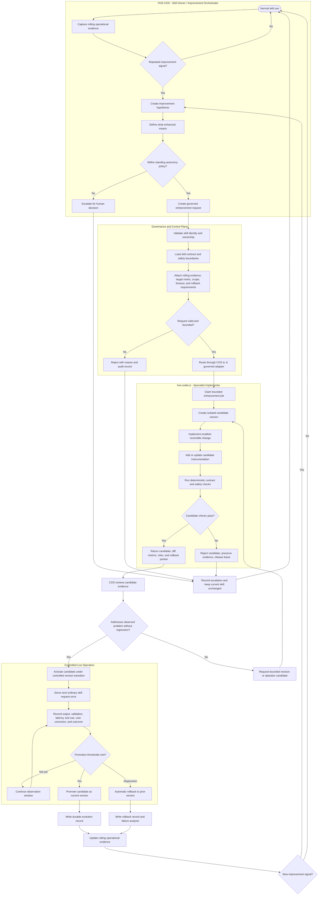
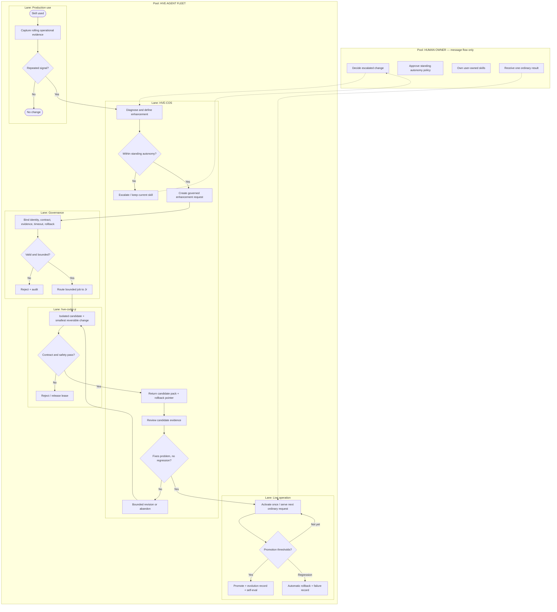

# Grok Review and Suggested Improvements — HVE Self-Evolved Skill Improvement Loop

**Date:** 2026-09-14  
**Version:** v1.0  
**Status:** Review artifact — does not authorize runtime mutation  
**From:** Grok (reviewer)  
**To:** HVE-COS (process owner), hve-coder-jr (specialist), Hans (decision owner)  
**Feature:** Grok review and suggested improvements  
**Related issue:** [HansHWestphal/hve-knowledge-and-operations#30](https://github.com/HansHWestphal/hve-knowledge-and-operations/issues/30)  
**Reviewed artifact:** [2026-09-14-hve-self-evolved-skill-improvement-loop-v1.0.md](./2026-09-14-hve-self-evolved-skill-improvement-loop-v1.0.md) (`e45f31f`)  
**Alpha use case:** x333 / `x-333-quote`

---

## 1. Purpose of this communication

Record Grok's review of the proposed COS → Jr skill-evolution business process, keep the process documents in the same durable comms layer, and list the smallest improvements that would make the loop safe to activate as the fleet alpha.

This communication does **not** authorize skill mutation, publication, autonomous promotion, or a change to standing policy. It is review and proposed hardening of the process already filed against issue #30.

---

## 2. Digest

The proposal is a governed owner→specialist skill-evolution loop, not a model that rewrites itself.

Ordinary production use is the baseline. COS watches real runs, turns a *repeated* signal into a hypothesis and a metric, and only then asks whether standing autonomy covers the change. If yes, the governance plane binds identity, contract, evidence, timeout, and rollback into a job. Jr builds an isolated candidate — the smallest reversible change — with instrumentation and deterministic checks. COS reviews the evidence. Live activation is a single ordinary request. The user never sees parallel baseline and candidate outputs. Telemetry against the rolling history decides promote / keep observing / automatic rollback. Every terminal path writes an audit record. A failed or inconclusive candidate leaves the live skill unchanged.

That design matches the #30 origin story. x333 attempted `skill_manage` against a user-owned skill (`created_by=None`) and was correctly refused. The loop exists so that incident becomes a governed proposal with a rollback pointer, not a silent patch.

### Fit to the stated goal

| Goal | Assessment |
|---|---|
| Measured | Strong. Rolling production is the baseline. Promotion and rollback are evidence-gated. |
| Controlled | Strong. COS decides. Jr implements inside a lease. No silent self-mutation. Failed candidate ≡ current skill unchanged. |
| Autonomous | Correctly scoped. Autonomy is the absence of a human task on the happy path, not the absence of gates. Human is an external participant reached only when a risk boundary is crossed. |
| Simple | Open tension. The happy path is eight steps. The full collaboration is five lanes, six XOR gates, three reject terminals, a revision loop, and an observation window. That is simple as a control system. It is not operable until the four withheld artifacts exist. |

The four artifacts the v1.0 process already withholds, and which still block activation:

1. Standing autonomy policy  
2. Risk classification  
3. Implementation contract / Jr governed adapter  
4. x333 numeric acceptance metrics and observation-window length  

Until those exist, the process document and this review are proposals, not runtime authority.

---

## 3. What is already right

- Separation of propose / bind / build / canary / record matches the intended fleet family: COS is owner-orchestrator, Jr is leased specialist, governance is a plane not a personality.
- Isolated candidate + rollback pointer is the only safe way to let a coder agent touch skills.
- "Serve next ordinary request once" is the correct canary for a single-user sovereign stack. There is not enough traffic for statistical A/B, and regenerating old outputs to fake a baseline is correctly forbidden.
- x333 is a sharp alpha. Character count, tool-call count, latency, mutation attempts, and publication state are mechanically observable. If the loop cannot evolve this skill without violating ownership, it cannot be trusted on any other skill.
- The ten invariants are the real design. Keep them verbatim.

---

## 4. Suggested improvements

These harden the existing loop. They do not replace it. None of them require adding a new happy-path stage.

### 4.1 Split the signal gateway

"Repeated improvement signal" is too coarse.

- **Efficiency friction** (extra validation passes, latency, tool-call count) may require repetition before a cycle starts.
- **Ownership or safety violation** (unauthorized `skill_manage`, contract break, publication-state ambiguity) is a single-event signal and should escalate even if it happened once.

The #30 incident itself is the second kind. If the gateway requires repetition, the original failure mode waits for a second mutation attempt before the process notices.

### 4.2 Separate COS as proposer from COS as reviewer

On the autonomy path, the same role writes the hypothesis and later judges "addresses observed problem without regression." That is acceptable for alpha only if:

- Governance's boundedness check is a real contract check, not a narrative, and
- Gate V is a checklist against the evidence pack (target metric, contract tests, rollback pointer, evidence hash), not a second COS opinion.

A recommendation remains non-completion evidence (invariant 9). Gate V must not be allowed to promote on recommendation language.

### 4.3 Cap the revision loop

`R3 → N` (request bounded revision) has no maximum. Add:

- max revisions (recommend 2 for alpha)
- job timeout already attached at bind time, surfaced as a timer that releases the lease
- explicit abandon path that writes an audit record and returns to current skill unchanged

### 4.4 Close the observation window with a timer

"Not yet → continue observation" can leave a candidate live indefinitely if the next ordinary uses do not arrive. Add:

- declared observation window (count of ordinary uses **and** wall-clock timeout)
- window elapsed with insufficient evidence → automatic rollback

This is how invariant 7 stays true when evidence is thin, not only when evidence is negative.

### 4.5 Make the Jr lease first-class on every path

Claim, exclusive workspace, timeout, and release currently appear mainly on the reject path. They must also run on success, revision, abandon, and timeout. A candidate without a released lease is an ownership leak.

### 4.6 Put Jr feasibility on the flow, or remove it from the RACI

The responsibility table asks Jr to "confirm implementation feasibility." The flow never does. Either:

- add a Jr "cannot implement inside bounds" message back to COS **before** a candidate version is created, or
- drop feasibility from the table so the contract is implement-or-reject-after-checks only.

### 4.7 Promote timeout, evidence hash, and rollback pointer to data objects

They are the control-plane payload, not labels on tasks. The governed enhancement request should always carry:

- skill identity and ownership class
- contract hash
- rolling evidence references
- target metric
- scope
- timeout
- rollback pointer
- evidence hash of the candidate pack

### 4.8 Encode user-owned vs curator-managed in standing autonomy

x333 is user-owned. Standing autonomy for mutation of user-owned skills must be empty unless the human owner has pre-authorized a change class. Otherwise the loop recreates the original #30 bug with better paperwork.

Draft / validated / handed-off / approved / published must remain distinct caller-visible states. A promoted candidate that is still unpublished must not look published.

### 4.9 Define self-evaluation as a structured comparison

Invariant 10 requires self-evaluation after every promoted change. Specify that it is:

- a comparison against the pre-registered target metric
- written into the evolution record
- unable to promote or retain anything by itself

### 4.10 Keep the happy path at eight steps

Do not add stages. If the diagram needs to get simpler later, collapse Governance H/I/J into one "bind request" subprocess and Jr M–P into one "build isolated candidate" subprocess. Keep the XOR gates. The gates are the simplicity.

---

## 5. Proposed alpha metric card (x333)

Not approved. Draft only, so the next decision has a concrete object to accept or reject.

| Field | Draft value |
|---|---|
| Signal (efficiency) | ≥ 2 ordinary runs in the rolling window with > 2 validation/balancing passes, or tool-call count ≥ 10, or latency ≥ 3 minutes |
| Signal (safety, single event) | Any `skill_manage` / mutation attempt, attribution failure, invalid count published as accepted, or ambiguous publication state |
| Target | Valid 333-character output, ≤ 2 validation passes, 0 mutation attempts, no browse, quote + attribution intact |
| Observation window | Next 3 ordinary x333 uses **or** 7 days, whichever first |
| Promote | Target met on the window with no contract/ownership regression |
| Rollback | Invalid count, attribution error, mutation attempt, latency worse than rolling median, ambiguous publication state, or window elapsed with insufficient evidence |
| Max Jr revisions | 2 |
| Ownership class | User-owned — no curator patch; human owner is the only risk-boundary approver |

---

## 6. Business process documents

The source process is preserved below so this review can be read without leaving the comms layer. The reviewed file remains canonical at:

[agent-communications/2026-09-14-hve-self-evolved-skill-improvement-loop-v1.0.md](./2026-09-14-hve-self-evolved-skill-improvement-loop-v1.0.md)

### 6.1 Purpose (from v1.0)

Define the ideal governed lifecycle for a skill improvement initiated by an agent owner and implemented by hve-coder-jr. The process uses ordinary production use as the rolling baseline. It does not require duplicate benchmark generation or parallel baseline and candidate outputs.

Routine low-risk improvements may proceed under standing autonomy policy. Changes that cross a declared risk boundary must escalate for human decision.

### 6.2 Canonical business process flow (v1.0 Mermaid)

### 6.3 Happy path — standing autonomy only

Human is not on this path. Any failed gate ends with the current skill unchanged and an audit record.

```mermaid
flowchart LR
    S([Skill used]) --> O[1 Observe rolling evidence]
    O --> H[2 Hypothesize named problem + metric]
    H --> A[3 Authorize in-policy request]
    A --> I[4 Implement isolated Jr candidate]
    I --> P[5 Prove contract + safety checks]
    P --> C[6 Canary one ordinary live use]
    C --> D[7 Decide promote or rollback]
    D --> L[8 Learn durable record + self-eval]
    L --> E([Current version evolved or unchanged])
    L -.-> O
```

### 6.4 Collaboration view — pools and lanes

BPMN 2.0 reading used for the review graphics:

- Pool `HUMAN OWNER` is an external participant. Sequence flow does not cross into it. Escalation and ordinary-result consumption are message flows.
- Pool `HVE AGENT FLEET` is white-box with five lanes: Production Use, HVE-COS, Governance, hve-coder-jr, Live Operation.
- Exclusive XOR gateways only. No parallel split.
- Collapsed subprocesses on the Level 0 sheet: Diagnose & define, Create request, Bind request, Build candidate, Activate-and-measure.

### 6.5 Process responsibilities (from v1.0)

| Stage | HVE-COS responsibility | hve-coder-jr responsibility | Required evidence |
|---|---|---|---|
| Observe | Monitor normal skill use and identify repeated friction | None unless delegated | Real outputs, corrections, latency, tool calls, failures |
| Diagnose | Convert observations into a specific improvement hypothesis | None | Problem statement and supporting production evidence |
| Define | State measurable success criteria and risk boundary | Confirm implementation feasibility | Target metric, scope, timeout, rollback requirement |
| Authorize | Decide whether standing autonomy permits the change | Reject work outside the bounded contract | Ownership, policy, approval class, workspace |
| Implement | Provide context and constraints | Build the smallest isolated candidate | Candidate version, diff, tests, instrumentation |
| Validate | Review candidate evidence and risk | Run deterministic contract and safety checks | Pass/fail results, regression checks, evidence hash |
| Operate | Select controlled activation window | Remain available for bounded correction or rollback | One ordinary user result |
| Measure | Compare candidate telemetry with rolling production history | Report execution and resource metrics | Quality, latency, tool calls, corrections, failures |
| Promote or rollback | Make lifecycle decision under standing policy | Supply rollback path and cleanup evidence | Promotion or rollback record |
| Learn | Update the next improvement hypothesis | Preserve implementation evidence | Durable evolution record |

Suggested RACI delta for v1.1 of the process, not applied here:

- Define / Jr: keep feasibility only if section 4.6 is added to the flow.
- Validate / COS: replace "review" with "apply Gate V checklist against the evidence pack."
- Operate / both: add "release lease" on every terminal path.
- Measure / system: add observation-window timer as a first-class event.

### 6.6 x333 reference case (from v1.0)

- **Observed signal:** repeated character-balancing work, 19 code calls, iteration-cap interruption, and approximately seven minutes for the resumed task. The #30 trigger additionally includes an unauthorized `skill_manage` attempt against a user-owned skill.
- **Improvement hypothesis:** reduce character-balancing work and eliminate unauthorized curation attempts while preserving the exact 333-character contract, quote fidelity, attribution, passage-grounded insight, no-browsing behavior, no skill mutation, and unpublished handoff state.
- **Candidate change:** hve-coder-jr implements a bounded formatter, validator, or control-plane change in an isolated version.
- **Live measurement:** COS observes ordinary subsequent x333 uses without generating duplicate baseline outputs. It records exact-count completion, validation calls, latency, user corrections, skill-management calls, handoff state, publication state, and safety-boundary violations.
- **Promotion:** retain the candidate if it improves the measured problem without reducing output quality or weakening ownership controls.
- **Rollback:** revert automatically for invalid counts, attribution errors, unauthorized mutation attempts, increased latency, or ambiguous publication state.

### 6.7 Non-negotiable invariants (from v1.0 — unchanged)

1. The rolling production record is the baseline.
2. COS owns the improvement decision; Jr owns bounded implementation.
3. No model silently changes its own skill.
4. Routine low-risk evolution does not require per-change human intervention.
5. Risk-boundary changes always escalate.
6. The user receives one ordinary result, not parallel baseline and candidate outputs.
7. A failed or inconclusive candidate leaves the current skill unchanged.
8. Every promotion and rollback produces durable audit evidence.
9. A recommendation is not completion evidence.
10. Self-evaluation is mandatory after every promoted change.

---

## 7. Status and recommended next decision

This review accepts the v1.0 loop as the right shape for the fleet alpha.

It does not accept the loop as ready to run.

Recommended next decisions, in order, still owned by Hans / COS — not by this review:

1. Accept or amend the suggested improvements in section 4 as v1.1 process deltas.
2. Write standing autonomy policy, with user-owned skills defaulting to "escalate."
3. Write risk classes (efficiency vs ownership/safety at minimum).
4. Write the Jr job/lease contract.
5. Accept or amend the draft x333 metric card in section 5.

No candidate version of x333 should be created until 2–5 exist.

— **Grok**  
Reviewer, Human Value Exchange
