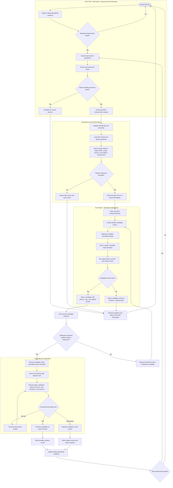

# HVE Self-Evolved Skill Improvement Loop

**Date:** 2026-09-14
**Version:** v1.0
**Status:** Proposed business process flow
**Owner:** HVE-COS
**Specialist:** hve-coder-jr
**Related issue:** HansHWestphal/hve-knowledge-and-operations#30

## Purpose

Define the ideal governed lifecycle for a skill improvement initiated by an
agent owner and implemented by hve-coder-jr. The process uses ordinary
production use as the rolling baseline. It does not require duplicate
benchmark generation or parallel baseline and candidate outputs.

Routine low-risk improvements may proceed under standing autonomy policy.
Changes that cross a declared risk boundary must escalate for human decision.

## Business process flow

## Process responsibilities

| Stage | HVE-COS responsibility | hve-coder-jr responsibility | Required evidence |
|---|---|---|---|
| Observe | Monitor normal skill use and identify repeated friction | None unless delegated | Real outputs, corrections, latency, tool calls, failures |
| Diagnose | Convert observations into a specific improvement hypothesis | None | Problem statement and supporting production evidence |
| Define | State measurable success criteria and risk boundary | Confirm implementation feasibility | Target metric, scope, timeout, rollback requirement |
| Authorize | Decide whether standing autonomy permits the change | Reject work outside the bounded contract | Ownership, policy, approval class, workspace |
| Implement | Provide context and constraints | Build the smallest isolated candidate | Candidate version, diff, tests, instrumentation |
| Validate | Review candidate evidence and risk | Run deterministic contract and safety checks | Pass/fail results, regression checks, evidence hash |
| Operate | Select controlled activation window | Remain available for bounded correction or rollback | One ordinary user result |
| Measure | Compare candidate telemetry with rolling production history | Report execution and resource metrics | Quality, latency, tool calls, corrections, failures |
| Promote or rollback | Make lifecycle decision under standing policy | Supply rollback path and cleanup evidence | Promotion or rollback record |
| Learn | Update the next improvement hypothesis | Preserve implementation evidence | Durable evolution record |

## x333 reference case

The x333 skill provides the reference use case:

- **Observed signal:** repeated character-balancing work, 19 code calls,
  iteration-cap interruption, and approximately seven minutes for the resumed
  task.
- **Improvement hypothesis:** reduce character-balancing work and eliminate
  unauthorized curation attempts while preserving the exact 333-character
  contract, quote fidelity, attribution, passage-grounded insight, no-browsing
  behavior, no skill mutation, and unpublished handoff state.
- **Candidate change:** hve-coder-jr implements a bounded formatter, validator,
  or control-plane change in an isolated version.
- **Live measurement:** COS observes ordinary subsequent x333 uses without
  generating duplicate baseline outputs. It records exact-count completion,
  validation calls, latency, user corrections, skill-management calls, handoff
  state, publication state, and safety-boundary violations.
- **Promotion:** retain the candidate if it improves the measured problem
  without reducing output quality or weakening ownership controls.
- **Rollback:** revert automatically for invalid counts, attribution errors,
  unauthorized mutation attempts, increased latency, or ambiguous publication
  state.

## Non-negotiable invariants

1. The rolling production record is the baseline.
2. COS owns the improvement decision; Jr owns bounded implementation.
3. No model silently changes its own skill.
4. Routine low-risk evolution does not require per-change human intervention.
5. Risk-boundary changes always escalate.
6. The user receives one ordinary result, not parallel baseline and candidate
   outputs.
7. A failed or inconclusive candidate leaves the current skill unchanged.
8. Every promotion and rollback produces durable audit evidence.
9. A recommendation is not completion evidence.
10. Self-evaluation is mandatory after every promoted change.

## Status and next decision

This is a proposed process artifact for issue #30. It does not authorize
runtime changes, skill mutation, publication, or autonomous promotion by
itself. The implementation contract, standing autonomy policy, risk
classification, and x333 acceptance metrics must be defined and approved
before activation.
